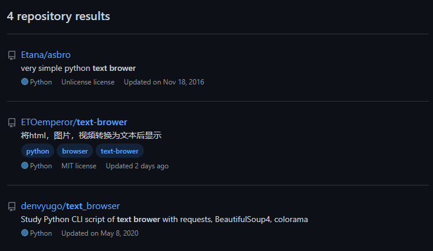

# text-brower

## Version:0.1

> 一个能用终端看网站的程序

> 使用：
* 使用`url {url}`查看网页
* 使用`exit`退出程序

>项目技术：
> 
> 解析html：
* 使用bs4.BeautifulSoup与chromium(使用Playwright，等待更新)解析html
* img与video标签中的内容会下载到缓存目录中转换为文字后播放(等待更新)

> 孤军奋战

>Licenise
* MIT Licenist
